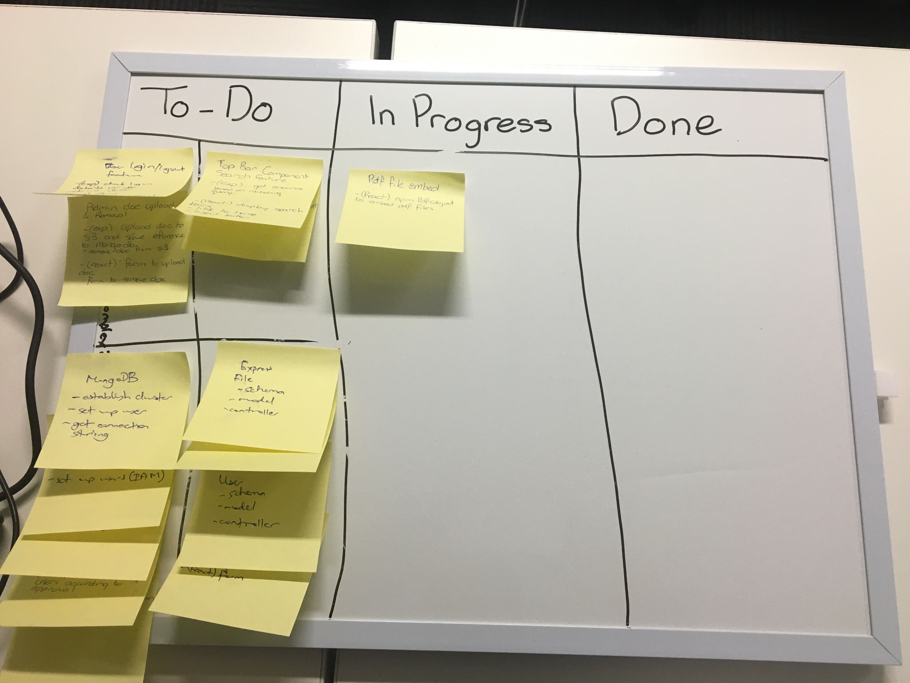

# AccordantHelp MERN Stack Project

React app: http://accordanthelp-react.s3-website-ap-southeast-2.amazonaws.com/

Express app: https://accordanthelp.herokuapp.com/

React repo: https://github.com/JC-Ferguson/react-app-MERN-project

Express repo: https://github.com/Mark-Ball/express-app-MERN-project

## Getting started

To deploy this app, take the following steps:

1. Clone the two (React app and Express app) repos. 

```git clone https://github.com/Mark-Ball/express-app-MERN-project.git```

```git clone https://github.com/JC-Ferguson/react-app-MERN-project.git```

2. Set up environment variables.

Create a ```.env``` file in the root of the __Express__ app. The following environment variables must be declared inside the .env. The words between <> should be replaced with your own database, keys, etc.

The project is designed to operate using an Amazon Web Services S3 bucket and MongoDB. You will need MongoDB set up on your computer to access a locally hosted database.

```
- PORT=3001 // any unused port is acceptable here
- DB_HOST=mongodb://localhost/<yourDBName> // any db name which is unique on your machine
- JWT_SECRET=<yourString> // any random string is acceptable here
- AWSAccessKeyId=<yourAccess> // 
- AWSSecretKey=<yourSecret> //
- Bucket=<yourBucketName> // AWS S3 bucket
```

The __React__ app's .env file is included in the repo because it does not contain any secret keys. Therefore a new .env file does not need to be created. Instead simply modify the .env with the url of your own Express app.

```
REACT_APP_EXPRESS=<yourExpressAppURL>
```

3. Install dependencies with ```npm install```.

4. Run the project in development mode with ```npm run dev``` or production mode with ```npm start```. The difference is that in development mode, the app will restart if changes are made to the files, and will restart after crashing.

# Project Management

The project used a physical kanban board to visualise the progression of features in the project.

To plan which features should be completed first, 'scrum poker' was used to estimate the complexity and importance of each feature. Each feature was categorised into one of four boxes inside the To-Do column, representing the priority of the feature.

The highest priority features are the ones with high importance and low complexity, and the lowest priority features are the ones with low importance and high complexity. Features in the other two boxes, high importance-high complexity and low importance-low complexity are intermediate. This categorisation allows makes the decision of which features to work on easier.

Work was split by feature, with a single developer being responsible for both the front-end and back-end implementation of that feature. The benefit of this approach was that it was easier to integrate the front and back ends because a single developer knew what data was being sent through the application. The features were assigned based on the individual's complexity assessment from Scrum Poker, meaning that each developer picked features to work on based on their confidence with the work.

Features were developed on their own branches, and named with a description of the feature. Before creating a pull request to add the features to master, the master branch was checked out and merged into the branch. Any merge conflict were then handled on the branch and tested before the pull request was made to merge the branch into master.

The progression of tickets on the kanban board is presented in the figures below.



__Figure 1.__ Kanban board at Day 1


__Figure 2.__ Kanban board on final day

# Testing

Testing was conducted with a combination of automated and manual tests.

## Testing in development

Testing in development was conducted using the Mocha and Chai packages. Testing of the Express app focused on the users and the files controllers. Tests can be run from the root of the project by typing into the terminal
```
npm test
```

## Testing in production

Testing in production was conducted manually. The Express app was tested using Postman, and the React app (which was connected to the Express app) was tested in the browser. Before testing, a series of tests were written, including what data would be entered and the expected result of the test. The results of these tests are provided below.


__Figure 1. Production tests__

# Packages used

## In production

The following packages were used in the production environment.

### Express

- __aws-sdk__: allows the application to programatically interface with AWS. In our application it was used to configure access to the S3 bucket so that files could be saved to and read from the bucket.
- __cors__: used to allow requests from a cross-origin to access the Express application.
- __dotenv__: allows variables declared in an environment (.env) file to be read. This is important because the application may connect to a different database, or be hosted on a different port depending on environments. 
- __Express__: a fast unopinionated, minimalist framework for node. Express is the web server within our application, with the role of routing incoming HTTP requests and using middleware to modify those requests before they arrive at the controllers.
- __jsonwebtoken__: creates a json web token (JWT) by hashing information related to the user (in our case we used the document id from MongoDB) and a secret string we save in our .env file. JWTs are a way to securely transmit information between parties as a JSON object. The information can be verified because it is digitally signed.
- __mongoose__: a MongoDB object modeling tool designed to work in asychronous environments. Allows the creation of schemas to control the information being written to the database, and the creation of models with methods to create, read, update, or delete documents in the relevant collection.
- __mongoose-bcrypt__: a mongoose plugin to encrypt information being saved into MongoDB and verify that incoming data is the same as the encrypted version. Used in this application to encrypt passwords when users register, and verify that passwords when the user attempts to login is correct.
- __multer__: middleware for handling multipart/form-data. Used in the Express application to allow form-data sent from the React application to be saved into storage.
- __multer-s3__: used with multer to allow the form-data to be saved to an S3 bucket, instead of locally.
- __passport__: express-compatible authentication middleware for Node.js. Passport authenticates requests using strategies which are defined in the two packages below and allows access to the route protected by the middleware if authentication succeeds, or returning a 400-series status code if authentication fails.
- __passport-jwt__: integrates into passport to authenticate users with JSON web tokens. 
- __passport-local__: integrates into passport to authenticate users with a username and password.

### React 

- __axios__: used to send http requests to the Express app and receive the response.
- __pdfobject__: a package which allows pdfs to be displayed on a web page.
- __react__, __react-dom__ and __react-scripts__: Javascript library for creating user interfaces from building blocks callec components. Automatically installed when using create-react-app.
- __redux__ and __react-redux__: used to enable the use of global state, so that state does not have to be lifted. Redux is not designed to work specifically with React, so the react-redux package is necessary to allow the two to be integrated.
- __react-router-dom__: allows access to the BrowserRouter and Route components, so the app can have different url endpoints.
- __semantic-ui-react__: official React integration for Semantic UI, allowing augmentations to html elements and access to pre-defined styling.

## In development

### Express

- __chai__: an assertion library often paired with mocha. Assertions allow us to use the pre-built 'assert', 'expect', or 'should' functions to test the results of our code against expectations. 
- __forever__: automatically restarts the node application if it crashes. Helpful in development because of the frequent file changes with errors which will cause the application to crash. Without the forever package, the application would need to be started by typing into the command line after every crash.
- __mocha__: a testing framework developed specifically for Node applications. Mocha was chosen as the testing framework over Jest because the Mongoose documents warn against using Jest, and instead strongly recommend Mocha. A testing framework makes it easier to write tests due to the pre-built syntax and presentation of results in the terminal. Testing functions by comparing the results of our code with an expected result. When actual and expected results differ, the test fails and we are informed of what was returned verrsus what was expected.
- __nodemon__: automatically restarts the node application when file changes are detected. Helpful in development because of the frequent file changes which we want to be able to observe the effect of immediately. Not used in production because we do not expect to be making frequent changes to code in the production environment.
- __supertest__: a module allowing testing of HTTP. Without supertest, we would need to use axios to send HTTP requests to our endpoints. The problem with this is that if a test were to fail, we may not know whether the failure was due to the network or our code. Supertest allows us to bypass the network to test our code directly, so any failures are due to errors in the code, not network issues.

### React

- __jest__: testing framework for Javascript which includes an assertion library and test runner in a single package.